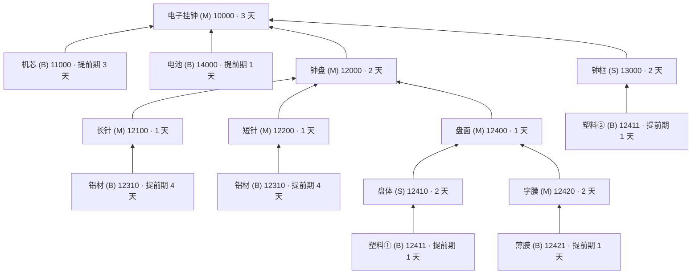

# 🕰️ 电子挂钟 ERP 生产流程演示

> **一个单文件的国产 ERP 教学演示台** —— 用一只「电子挂钟」把 BOM 多级结构、MPS/MRP 运算、采购 · 委外 · 自制 · 总装 · 出入库 · 财务结算全流程，压缩进**一个可以揣在 U 盘里的 HTML 文件**。

[](电子挂钟ERP生产流程演示.html)
[](电子挂钟ERP生产流程演示.html)
[](#-快速开始)
[](#-界面导览)

---

## 📖 这是什么

一个**零依赖、零构建、零网络**的前端教学演示，用来讲清「**制造企业 ERP 到底在管什么**」：

- 用 **13 个物料、5 个层级** 的真实 BOM（含 **2 个共用件**），把「成品 → 组件 → 零件 → 原材料」的层级结构画清楚；
- 用 **15 个演示步骤、8 条部门泳道、2 块联动看板**，把**课本图 1-1** 的业务流程一环一环播出来；
- 用 **15 个真实单据**（销售订单、MPS 表、MRP 表、请购单、采购订单、入库单、出库单、委外单、结算单……）把每一步的输入输出落到实处；
- 最后再用一个 **拖拽小游戏** 检验学生是否真的分得清「自制件 / 采购件 / 委外件」。

整套系统只用了 **HTML + CSS + 原生 JavaScript**，没有框架、没有 CDN、没有后端，**断网、老电脑、投影仪**都能跑。

---

## ✨ 亮点一览

| | 功能 | 说明 |
|---|---|---|
| 🌲 | **BOM 结构树** | SVG 自动布局的多级树，节点自下而上流向成品；**支持共用件**（铝材、塑料各被两个父件共用，树上画两次）；悬停任意节点，**高亮它的「来源 → 去向」整条路径**，其余节点淡出 |
| 🏭 | **生产流程流水线** | 5 个阶段卡片演示「原材料采购 → 委外加工 → 零件加工 → 组件装配 → 成品总装」，每阶段的投入 / 产出物料一眼可读 |
| 📋 | **物料清单（BOM 展开）** | 13 个唯一物料的层级、编码、名称、类型、单位、**单位用量（共用件自动汇总）**、**提前期**、父件、直接子件全表展开 |
| 🎬 | **经营业务流程演示** | 15 步动画演示：客户 → 销售部 → 计划部（MPS / MRP / 计划下达）→ 生产车间 → 仓库 → 采购部 → 供应商 → 财务部 |
| 🧾 | **单据卡片** | 每一步同步弹出对应的**业务单据**（单号 + 表头 + 明细行），把抽象流程变成能看懂的单据流 |
| 📦 | **三仓库存看板** | 01 原辅料仓 / 02 半成品仓 / 03 成品仓，随演示步骤实时增减，库存条动画变化 |
| 🚚 | **物料流动看板** | 工厂 / 委外商 / 三个仓库的物资进出，与上方流程图**同步演示**，看得见「物料在跑」 |
| 🎮 | **物料分类小游戏** | 每局随机 10 个互不相同物料（必含 ≥1 个委外件），拖进 M / B / S 三个箱子；答错立刻给出正确答案 + 错题复盘 |
| ⌨️ | **全键盘操作** | 讲课不用摸鼠标：方向键翻页、空格播放、数字键跳步、`D` 同屏、`R` 重播本步 |
| 🔁 | **重播本步** | 一个按钮把当前环节的动画重放一遍（自动回退到上一步状态再播，库存不会重复累加） |
| 🖥️ | **同屏演示模式** | 一键把两块看板压进同一屏（自动反推画幅宽度，适配 1080P / 4K 投影） |

---

## 🚀 快速开始

**方式一：直接双击（推荐）**

```text
双击  电子挂钟ERP生产流程演示.html
```

**方式二：拖进浏览器**

把文件拖到 Chrome / Edge / Firefox 窗口里松手即可。

**方式三：随身携带**

拷到 U 盘 → 插到教室电脑 → 双击打开。**不需要安装、不需要联网、不需要任何运行环境。**

> 💡 放映前建议按一次 `F11` 全屏，再按 `D` 进入「同屏演示」，投影效果最佳。

---

## 🖥️ 界面导览

页面从上到下分为 5 张卡片：

```text
┌────────────────────────────────────────────────────────────┐
│ ① BOM 结构树        悬停高亮整条来源/去向路径（共用件两处同亮）│
├────────────────────────────────────────────────────────────┤
│ ② 一整套生产流程     5 阶段卡片：采购→委外→加工→装配→总装   │
├────────────────────────────────────────────────────────────┤
│ ③ 物料清单（BOM 展开）13 个物料 × 9 列全字段表（含提前期）   │
├────────────────────────────────────────────────────────────┤
│ ④ 企业经营业务流程演示 ★核心                              │
│    ├─ 15 步控制器（上一步/下一步/重播本步/自动播放/同屏/重置）│
│    ├─ 部门泳道流程图（8 泳道 · 21 节点 · 22 条连线）         │
│    ├─ 物料流动看板（工厂 / 委外商 / 三仓，同步动画）        │
│    └─ 单据卡片 + 库存看板（随步骤实时变化）                 │
├────────────────────────────────────────────────────────────┤
│ ⑤ 物料分类拖拽小游戏（同文件内的第二个视图）                │
└────────────────────────────────────────────────────────────┘
```

配色语义（全站统一）：

| 颜色 | 类型 | 含义 |
|:---:|:---:|---|
| 🔵 蓝 | **M** | 自制件 —— 由本厂加工 / 装配生产 |
| 🟠 琥珀 | **B** | 采购件 —— 向供应商采购 |
| 🟢 绿 | **S** | 委外件 —— 本厂发料给委外商加工后收回 |
| 🔵 蓝虚线 | — | 信息反馈流（如销售预测、MPS 反馈），**不产生库存变动** |

---

## 🌲 BOM 结构（示例数据）

演示产品：**电子挂钟（成品 10000）**，订单量 100 个，共 **13 个唯一物料 / 5 个层级**（第 0 层成品 → 第 4 层原材料；结构树上共 15 个方框，因为铝材、塑料是共用件，各出现两次）：



### 物料清单速查

| 层级 | 编码 | 名称 | 类型 | 单位用量 | 提前期 | 父件 |
|:---:|---|---|:---:|---|:---:|---|
| 0 | 10000 | **电子挂钟** | 🔵 M | 1 个 | 3 天 | —（成品） |
| 1 | 11000 | 机芯 | 🟠 B | 1 个 | 3 天 | 电子挂钟 |
| 1 | 12000 | 钟盘 | 🔵 M | 1 个 | 2 天 | 电子挂钟 |
| 1 | 13000 | 钟框 | 🟢 S | 1 个 | 2 天 | 电子挂钟 |
| 1 | 14000 | 电池 | 🟠 B | 1 个 | 1 天 | 电子挂钟 |
| 2 | 12100 | 长针 | 🔵 M | 1 个 | 1 天 | 钟盘 |
| 2 | 12200 | 短针 | 🔵 M | 1 个 | 1 天 | 钟盘 |
| 2 | 12400 | 盘面 | 🔵 M | 1 个 | 1 天 | 钟盘 |
| 3 | **12310** | 铝材 🔗 | 🟠 B | **14 g**（长针 8 + 短针 6） | 4 天 | 长针、短针（**共用**） |
| 3 | 12410 | 盘体 | 🟢 S | 1 个 | 2 天 | 盘面 |
| 3 | 12420 | 字膜 | 🔵 M | 1 个 | 2 天 | 盘面 |
| 4 | **12411** | 塑料 🔗 | 🟠 B | **320 g**（盘体 200 + 钟框 120） | 1 天 | 盘体、钟框（**共用**） |
| 4 | 12421 | 薄膜 | 🟠 B | 0.5 g | 1 天 | 字膜 |

> **统计**：1 个成品 · 6 个自制件(M) · 5 个采购件(B) · 2 个委外件(S) · **5 个层级**（第 0 层成品 ~ 第 4 层原材料）
> **共用件**（表中标 🔗）：同一个物料编码被多个父件共用，**各父件下的单位用量不同**——这是 ERP 里很典型、也很容易被学生搞错的一点。

### MRP 展开结果（订单 100 个）

| 物料 | 毛需求 | 物料 | 毛需求 |
|---|---|---|---|
| 铝材 12310 | **1400 g**（8g×100 + 6g×100） | 长针 / 短针 / 字膜 | 各 100 个 |
| 塑料 12411 | **32000 g**（200g×100 + 120g×100） | 盘面 / 钟盘 / 盘体 / 钟框 | 各 100 个 |
| 薄膜 12421 | 50 g | 机芯 / 电池 | 各 100 个 |

---

## 🎬 业务流程演示：15 步

演示以 **产品销售订单为起点、以计划为主轴**，还原课本图 1-1 的完整链条（订单量 100 个，客户「华美商贸」）：

| 步 | 环节 | 责任部门 | 关键单据 |
|:---:|---|---|---|
| 0 | 初始状态（三仓为空） | 系统 | — |
| 1 | ① 订购需求 & 订单维护 | 客户 → 销售部 | 销售订单 `SO-2026-001` |
| 2 | ② 销售预测（信息反馈） | 销售部 → 计划部 | 销售预测表 `FC-2026-09` |
| 3 | ③ **MPS 运算**（主生产计划） | 计划部 | MPS 表 `MPS-2026-001` |
| 4 | ④ **MRP 运算**（BOM 多层展开） | 计划部 | MRP 表 `MRP-2026-001` |
| 5 | ⑤ 采购计划 & 生产计划下达 | 计划部 | `PP-2026-001` / `MP-2026-001` |
| 6 | ⑥ **采购订货**（请购 → 下单 → 供应商确认 → 发货） | 采购部 → 供应商 | 请购单 / 采购订单 / 发货单 |
| 7 | ⑦ 验收入库（收料） | 仓库 | 采购入库单 `IN-2026-001` |
| 8 | ⑧ 生产领料 · 零件加工 | 仓库 → 生产车间 | 材料出库单 `MO-OUT-001` |
| 9 | ⑨ 生产完工 · 完工入库 | 生产车间 → 仓库 | 产成品入库单 `MO-IN-001` |
| 10 | ⑩ **委外加工**（发料 → 注塑 → 委外入库） | 仓库 ⇄ 委外商 | 委外发料单 / 委外入库单 |
| 11 | ⑪ 生产领料 · 盘面与钟盘装配 | 仓库 → 生产车间 | 出库单 / 入库单 `MO-OUT-002` |
| 12 | ⑫ 成品总装 · 完工入库 | 生产车间 → 仓库 | 出库单 / 入库单 `MO-OUT-004` |
| 13 | ⑬ 销售出库 | 仓库 → 客户 | 销售出库单 `SO-OUT-2026-001` |
| 14 | ⑭ 财务结算（付款 / 收款） | 财务部 | 付款单 / 收款单 `AP` `AR` |
| 15 | ⑮ 收到货物 · 闭环完成 | 客户 | 客户签收单 `POD-2026-001` |

> 第 ⑥ 步把原来「请购处理 / 采购订货 / 接受订货 / 供应商发货」四个环节**合并成一步连续演示**（一次跑完整条采购业务链），单次飞行动画按比例缩短，整步耗时与其它步骤相当。

演示里的示例金额（用于讲资金流）：

```text
采购付款  ¥ 96,800   →  鸿运电子配件（5 种采购件）
委外加工费 ¥ 1,200   →  宏达注塑
销售收款  ¥ 128,000  ←  华美商贸（电子挂钟 100 个）
```

**仓库归属规则**（本演示的一个易错点，值得单独讲）：

- `01 原辅料仓库`：铝材 / 塑料 / 薄膜 **3 种**原材料
- `02 半成品仓库`：机芯、电池（总装用组件）+ 全部自制 / 委外半成品
- `03 成品仓库`：电子挂钟

---

## ⌨️ 操作与快捷键

### 业务流程演示

| 操作 | 效果 |
|---|---|
| `←` / `→` | 上一步 / 下一步 |
| `空格` | 播放 / 暂停自动演示 |
| `0` – `9` | 跳到对应步骤 |
| `D` | 切换「同屏演示」（两块看板缩进一屏） |
| `R` | **重播当前环节动画**（自动回退到上一步状态，库存不会重复累加） |
| 点击看板节点 | 直接跳到该环节 |
| 「↺ 重播本步」按钮 | 同上，鼠标操作 |
| 速度下拉框 | 慢速 / 中速 / 快速 |

### 物料分类小游戏

| 操作 | 效果 |
|---|---|
| 拖拽卡片 | 放进 M / B / S 分类箱 |
| `1` / `2` / `3` | 键盘直接分类（自制件 / 采购件 / 委外件） |
| `空格` / `回车` / 点击反馈文字 | 跳过等待，立刻进入下一题 |

**游戏规则**：每局随机抽 **10 个互不相同**的物料（至少含 1 个委外件 S），每个物料**只有一次机会**；答对得 1 分并停留 2 秒，答错会**高亮正确答案所在的箱子 + 标出你选错的位置**，停留 4 秒后自动进入下一题。结束后给出**错题复盘**：你选了什么 → 正确答案是什么。

---

## 🧩 想改数据？只改一个对象

整套演示的数据源是文件里的 **一个 `BOM` 对象**（约第 1012 行）。树形图、物料表、MRP 运算、库存看板、游戏题库**全部由它自动派生**——改完刷新页面即可，无需改动任何渲染代码：

```js
const BOM = {
  code: "10000", name: "电子挂钟", type: "M", unit: "个", qty: 1, lead: 3,
  children: [
    { code: "11000", name: "机芯", type: "B", unit: "个", qty: 1, lead: 3 },
    { code: "12000", name: "钟盘", type: "M", unit: "个", qty: 1, lead: 2, children: [
      { code: "12100", name: "长针", type: "M", unit: "个", qty: 1, lead: 1, children: [
        { code: "12310", name: "铝材", type: "B", unit: "g", qty: 8, lead: 4 } ] },
      { code: "12200", name: "短针", type: "M", unit: "个", qty: 1, lead: 1, children: [
        { code: "12310", name: "铝材", type: "B", unit: "g", qty: 6, lead: 4 } ] },  // ← 同一编码，共用件
      /* ... */
    ]},
  ]
};
```

| 字段 | 含义 | 注意 |
|---|---|---|
| `code` | 物料编码 | **可重复**：同一编码出现在多个父件下 = 共用件 |
| `name` | 物料名称 | 显示用 |
| `label` | 出现位置名（可选） | 用于区分同一物料的两次出现，如 `塑料① / 塑料②` |
| `type` | `M` 自制 / `B` 采购 / `S` 委外 | 决定配色与游戏答案 |
| `unit` | 单位（个 / g） | 影响数量显示 |
| `qty` | **单位用量** | 父件每产 1 个所需的数量（共用件在不同父件下可以不同） |
| `lead` | **提前期（天）** | 显示在物料清单表里 |
| `children` | 子件数组 | 空数组 / 省略 = 叶子（原材料） |

其他常用可调参数：

| 常量 | 位置 | 作用 |
|---|---|---|
| `ORDER_QTY` | 流程模块开头 | 演示订单量（默认 `100`） |
| `CUSTOMER` / `DATE_TODAY` | 同上 | 客户名 / 演示日期 |
| `GAME_TOTAL` | 游戏模块 | 每局题目数（默认 `10`） |
| `WAIT_OK` / `WAIT_NO` | 同上 | 答对 / 答错后的停留秒数 |
| `ANIM_SCALE` | 看板模块 | 动画时长比例（便于自动化测试加速） |

> ⚠️ 换了产品结构后，若想保持流程演示贴近实际，可同步调整 `FLOW_STEPS`（演示步骤与单据）、`WAREHOUSES`（三仓物料归属）中的物料编码。

---

## 🛠️ 技术实现

**技术栈**：原生 HTML + CSS + JavaScript，**无框架、无构建、无依赖、无网络请求**。打开即用，源码即文档。

一些值得一提的实现细节：

- **SVG + HTML 混合渲染**：BOM 树用 SVG 画连线、用绝对定位的 HTML 卡片做节点，兼顾「连线路由精确」与「文字排版舒适」；
- **布局自动推导**：叶子节点按顺序编号，父节点坐标取子节点平均，树的宽高、画布尺寸、连线折点全部由数据算出来；
- **共用件数据模型**：物料表按**编码去重**（13 行）、结构树按**出现次数**渲染（15 个方框）；单位用量沿树累加（铝材 8g+6g=14g），MRP 按**出现对象**递归而不是按编码查表，否则共用件会一直用「第一份」的用量；
- **自适应字号**：看板字号跟随画幅宽度线性缩放（`--bs` / `--mvs` 变量），投影到大屏时文字同步放大；
- **兼容性兜底**：`aspect-ratio` 需要 Chrome 88+，代码检测到老内核会**用 JS 显式补高度**，避免看板整个消失；中文字体栈**刻意不用 `-apple-system` / Segoe UI 打头**（它们没有中文字形，会回退成发虚的宋体），而是按「微软雅黑 → 苹方 → 思源黑体 → 文泉驿 → SimHei」排列；
- **动画打断保护**：用**代号（`animGen`）**作废旧动画，避免快速点「上一步/下一步/重播」时被打断的旧动画跑完又把库存变动多加一遍；
- **重播不重复记账**：重播本步会先回退到上一步状态再完整播放，而不是把本步直接再放一遍；
- **同屏模式反推画幅**：实测控件高度而非写死数值，控制条换行时也能自动收敛到合适宽度；
- **零答案泄露的游戏配色**：待分类卡片**统一用中性灰蓝**，绝不能按 M/B/S 上色，否则等于把答案写在卡面上。

---

## 🌐 兼容性

| 浏览器 | 状态 |
|---|---|
| Chrome / Edge（近 3 年版本） | ✅ 完整体验 |
| Firefox | ✅ 完整体验 |
| Safari（macOS / iPadOS） | ✅ 完整体验 |
| 国产浏览器（极速模式） | ✅ 可用 |
| IE 11 | ⚠️ 不保证（使用了 `const` / 箭头函数 / Pointer Events） |
| 手机浏览器 | ✅ 可用（触摸拖拽已适配） |

---

## ❓ 常见问题

<details>
<summary><b>需要装 Python / Node / 服务器吗？</b></summary>

完全不需要。双击 HTML 文件即可，浏览器就是运行时。
</details>

<details>
<summary><b>为什么双击后页面是空的 / 样式乱掉？</b></summary>

请确认文件**没有被重命名成 `.txt`**，并尽量用 Chrome / Edge 打开。仍然异常的话，按 `F12` 看看控制台是否有报错。
</details>

<details>
<summary><b>投影时字太小怎么办？</b></summary>

按 `D` 进入「同屏演示」，页面会按屏幕实际高度反推画幅宽度、把两块看板压进一屏；若仍偏小，可关掉同屏用整页模式（字号更大，只是需要滚动），或用浏览器 `Ctrl` + `+` 缩放。
</details>

<details>
<summary><b>为什么铝材 / 塑料在树上有两个框？</b></summary>

这是**共用件**：铝材（12310）同时供长针和短针，塑料（12411）同时供盘体和钟框。同一个物料编码被多个父件共用，所以树上按出现次数画了两个框，物料清单里仍是**一行**（用量自动汇总）。悬停时两个框会一起高亮。
</details>

<details>
<summary><b>能改成别的产品吗？</b></summary>

可以。只需替换 `BOM` 对象（见上文「想改数据？」），树、表、MRP、库存、游戏题库会全部自动跟着变。
</details>

<details>
<summary><b>游戏里的分数会保存吗？</b></summary>

不会。演示是纯前端无状态的，刷新即重置，适合课堂上反复开局。
</details>

---

## 📄 许可与用途

用于 **ERP / 生产运作管理 / 管理信息系统** 等课程的课堂演示与教学讲解。

数据（BOM、单据号、客户名、金额、提前期）均为**教学示例**，不代表任何真实企业。

---

<div align="center">

**🕰️ 电子挂钟 ERP 演示 · 单文件离线运行 · 可复制到 U 盘随身携带**

</div>
